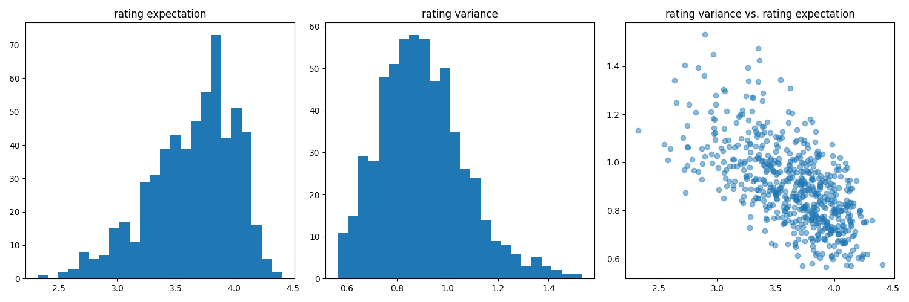
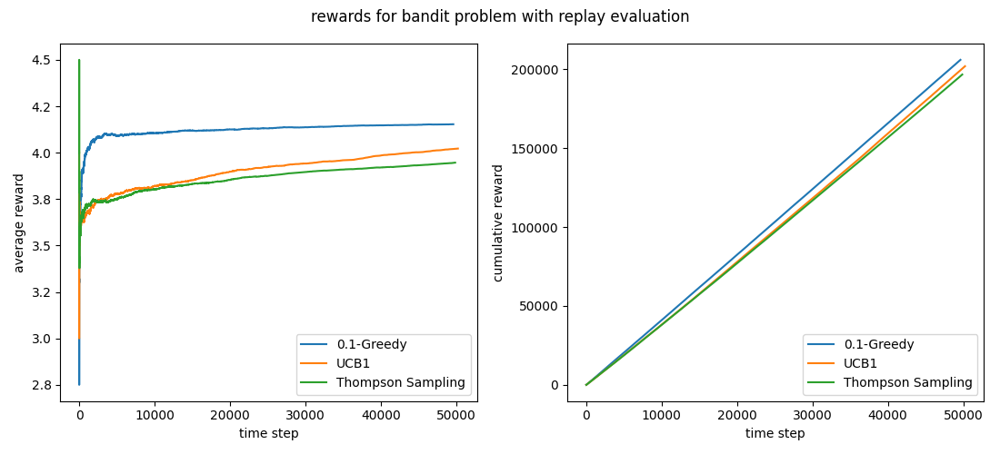
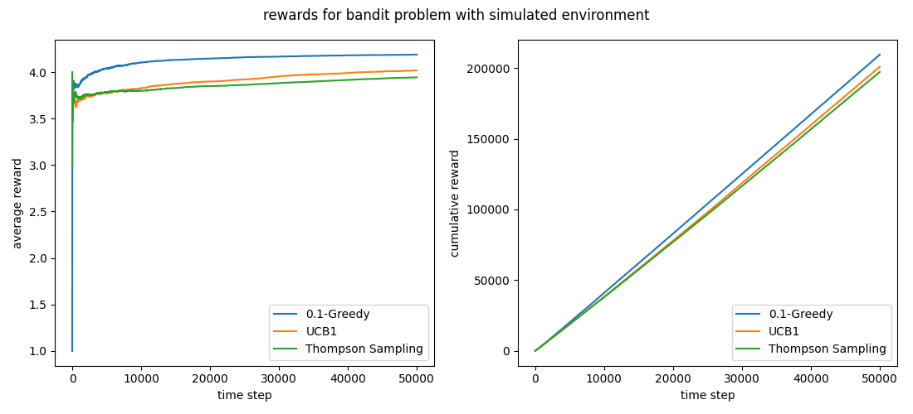
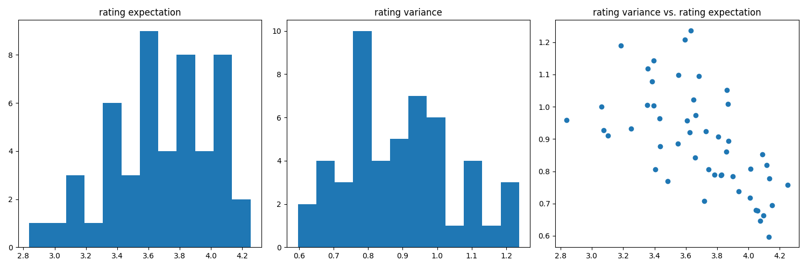
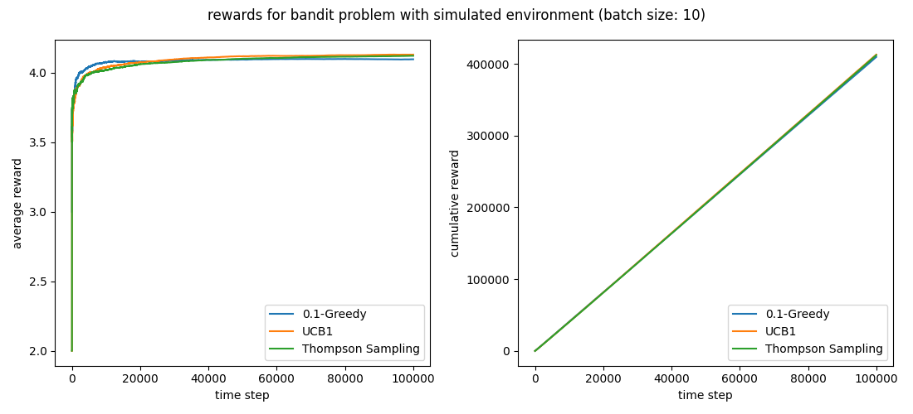
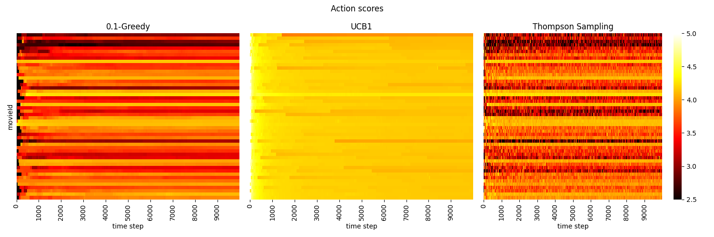

# Unbiased offline evaluation of multi-armed bandit algorithms

Offline evaluation of a multi-armed bandit algorithm avoids live testing (with bucket tests
for instance) and its shortcomings (negative impact on users, deploying efforts, etc.).
If the problem is simple enough, one way to perform an offline evaluation is to
simulate the environment, but when this is not possible or requires too much work,
a workaround has to be found.

Here I evaluate several classical online algorithms with a method called **replay evaluation**,
which makes use of historical stream events generated by another algorithm, and compare
the results with the ones obtained in a simulated environment.
The replay method has been introduced in the following paper
([arXiv](https://arxiv.org/abs/1003.5956)):

> Unbiased Offline Evaluation of Contextual-bandit-based News Article Recommendation Algorithms,
> Li *et al.*, WSDM Conference, 2011.

The toy problem that I'm considering is a movie recommendation system, where the objective is
to maximize the ratings of the movies that each user is served.
I'm using the [MovieLens 25M Dataset](https://grouplens.org/datasets/movielens/25m/).

## Description of the problem

At each time step, a random user receives a slate of 5 movie recommendations.
She picks one movie and then gives a rating on a 5-star scale with half-star increments
(0.5 to 5.0 stars).
The objective is to maximize the cumulative sum of all ratings.

I evaluate the following classical policies:
- Epsilon Greedy algorithm;
- Upper Confidence Bound algorithm (UCB1);
- Thompson Sampling algorithm (TS).

Since each user is served a slate of 5 movies, and not just one, a recommendation consists of
the top 5 movies with the highest scores that an algorithm uses to order these movies and
choose the best action.
However, a feedback is only available for the movie which has been picked by the user.

## Replay evaluation

The principle of replay evaluation is very simple:
given a stream of historical events, each comprising an action and a reward generated by
some unknown and a priori different policy than the one being tested, at each time step,
if the action chosen by the policy being tested matches the one reported in the historical event,
then the pair action/reward is saved in an history logbook.
On contrary, if the current action doesn't correspond to the one reported in the historical event,
then this event is dropped and nothing gets recorded.

This procedure yields an **unbiased evaluation** of any online algorithm, provided that we have
*i.i.d. events drawn from a uniformly random logging policy*.

Here the logged events are the reviews available in the MovieLens 25M dataset.
It contains 25 million ratings applied to 62000 movies by 162000 users.
To meet the requirement of the uniformly random logging policy, for each movie in the dataset
with enough reviews, I take a random sample of size 10000.
I thus obtain a dataset with 588 different movies (and so 5880000 events).
The rating expectations and variances have the following distributions.

For each logged event, if the movie is contained in the slate of recommendations proposed by
an algorithm, then the pair movie/rating is appended to the history logbook.
To speed up the computation time, an algorithm receives a batch of 100 events, for which it makes
the same recommendation, and gets updated after having observed the feedback of these 100 events.
Note that the final history for the three algorithms contains approximately 50000 events each,
which means that, on average, less than one event per batch gives a feedback.

## Simulated environment

To compare the results obtained by the replay evaluation, I simulate the environment
in the following way.
For each of the 588 movies, I compute the empirical frequencies of the ratings.
Then at each time step, a movie is drawn at random in the recommendation slate and
a rating is generated with a probability equal to its frequency in the dataset.

To have policy update conditions similar to the replay evaluation, I chose to test the algorithms
on 50000 events with updates after each event.

## Results

To reproduce the results, after cloning the repo, you need to download
the [MovieLens 25M Dataset](https://grouplens.org/datasets/movielens/25m/) and
move the files into a directory called `data`.
This `data` folder should at in the same location as the `src` folder (i.e., at the root of the repo).
If you want to use another MovieLens dataset, it is also possible as long as it contains
a `ratings.csv` file.
Then you can run `main.py` script.
The python packages necessary to run the script are *numpy*, *scipy*, *matplotlib*, *pandas*
and *tqdm* (plus *seaborn* for the bonus part).

Below are the average ratings and cumulative ratings for the replay evaluation and
with the simulated environment, respectively.
We observe that the results are very close, hence confirming the unbiased property of
the replay evaluation. 

## Bonus: visualization of action scores

Below is a heatmap visualization of the action scores (that is, the movie scores) that
the three algorithms use to select the best movies:
- for the Epsilon Greedy algorithm, the score of a movie is simply the empirical mean of its ratings;
- for the UCB1 algotihm, the score of a movie is the sum of the empirical mean of its ratings and
an upper confidence bound (derived from Hoeffding's inequality);
- for the Thompson Sampling algorithm, the score of a movie is drawn randomly from
the prior distribution of its expected rating.

To have a readable graph, the number of movies in the logged events has been reduced to 50
(with 10000 ratings for each movie).
We get the following distribution for the rating expectations and variances.

The average and cumulative ratings with 50 movies in the simulated environment are reproduced below.
I used a batch size of 10 and a number of policy updates equal to 10000 (hence 100000 total events).

And finally the movie scores of the three algorithms at each time step are as follows.

